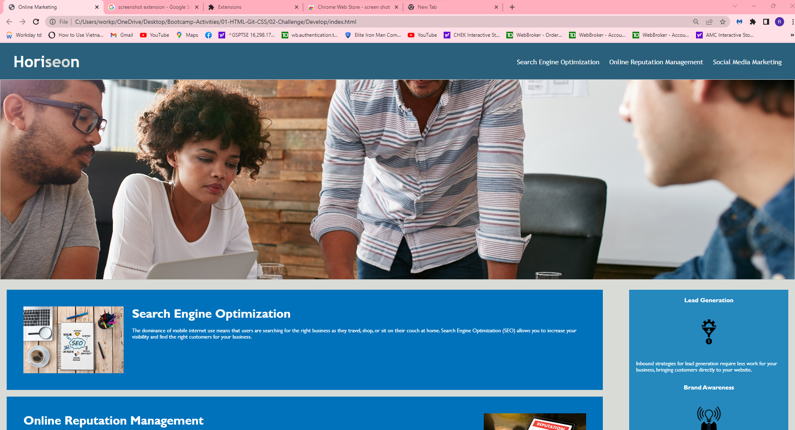
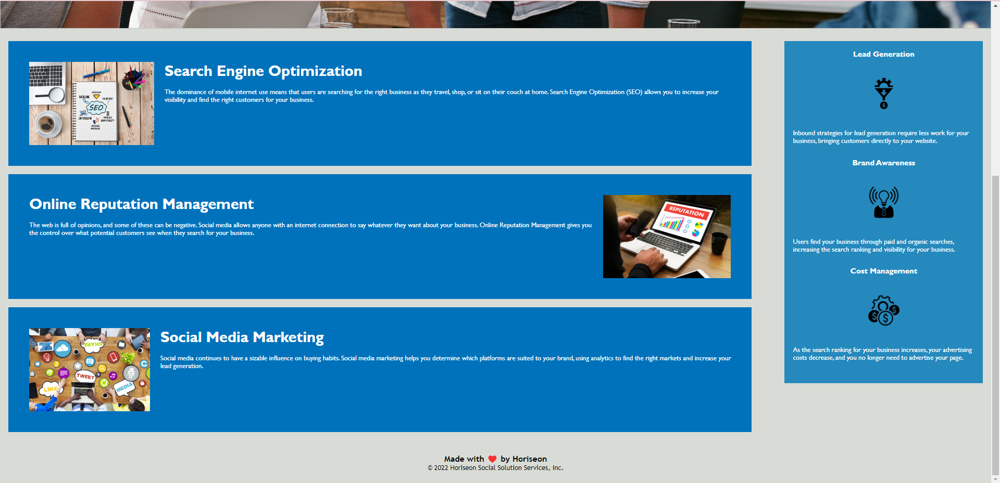

# INTRODUCTION
  1. Refractor existing code to make it more accessible
  2. Clean up redundant code
  3. Add image tags to make it more accessible
  4. Meet acceptance criteria
  5. Check that all links are functioning correctly.
  6. Consolidate selectors and Properties
  7. Add comments to CSS File
# Table of Contents
1. Motivation
2. Bill Status
3. Screen Shots
4. Installation
5. Contribute 
6. Credits
7. License 
# Motivation
- Completed project for U OF T Coding Bootcamp
# Bill Status
- Project completed
- Added nav to reduce redundancy
- Condensed Benefits and Content to one class to clear redundant code
- Added HREF to fix anchor tag bug
- Added Side element to properly add semantic benefits
- Commented CSS to Organize stylings
- Added proper semantic elements to make the page more accessible
# Screen Shots
- Image of working website 

# Installation
- N/A
# Contribute
If you would like to contribute simply create a issue!
# Credits
- N/A
# License
- N/A